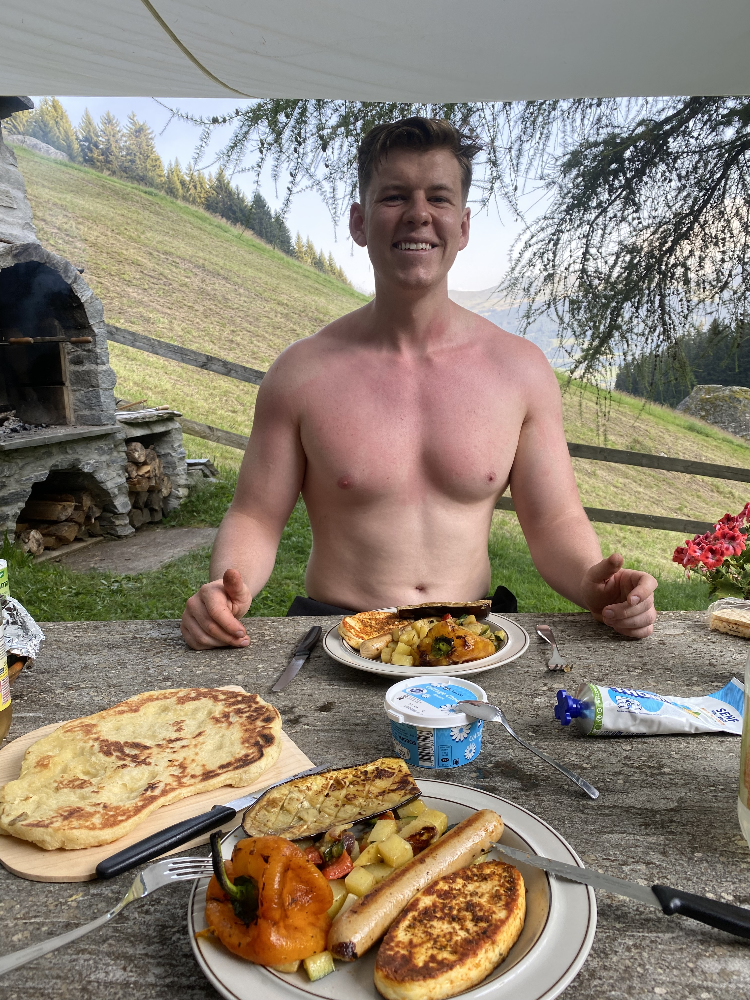

# Happy Birthday Valentin!

Will i leider hüt ned bi dier sii kan do a kliini digitali Überrasching für di 💌

## <3
### Mier hend scho so viel schöni Erinneriga zäma dörfa sammla, do es paar vo mina favorita hihi. Du bisch so en wunderschöna Mensch (inside and out!) und i bin eifach mega dankbar dass es di git. 

  
  
  
  
  

## Bisch parat für dis Geschenk? 🎁

  <h2>Gschenkli-Generator</h2>
  

    Hmm was wirds wohl...?
    Spin the button to find out!
  

  <button id="spinButton" onclick="spinGift()">Zeig Gschenk mann!</button>

## ✨Kleiner Disclaimer✨

Du kasch so lang spinne bis mit dinem Gschenk zfrieda bisch! Kumulativi Gschenk sind in Usnahmefäll au möglich ;)

## Hab dich lieb, gnüss din Tag! 💗

---

## 
